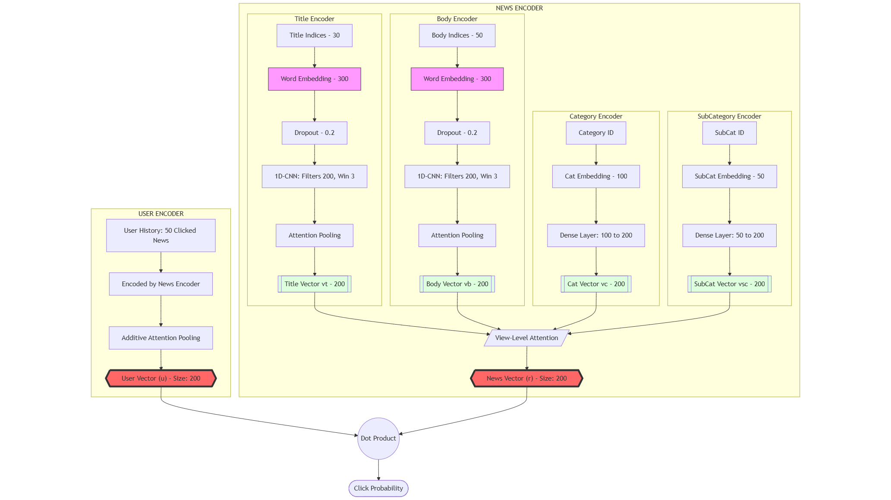
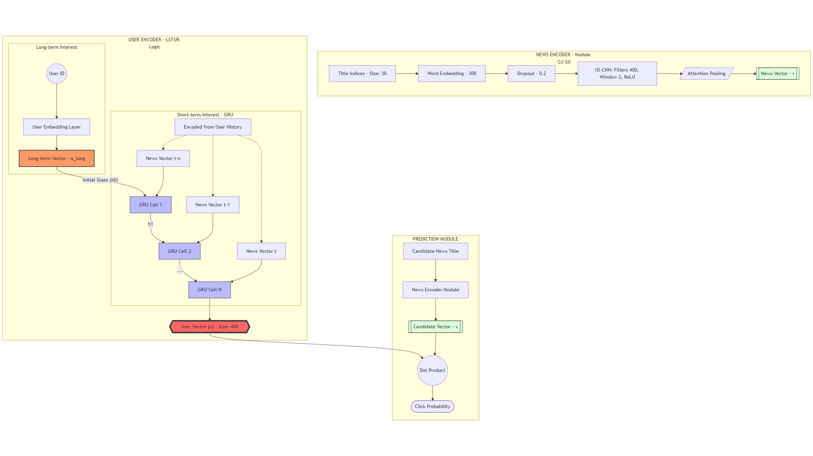
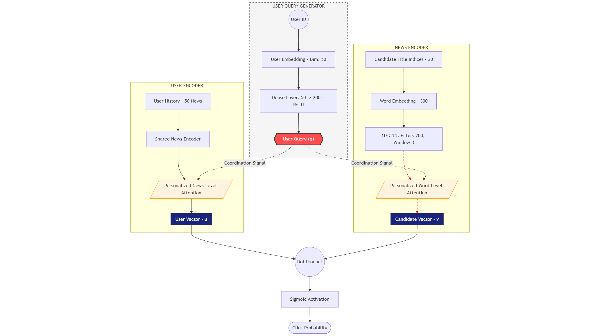
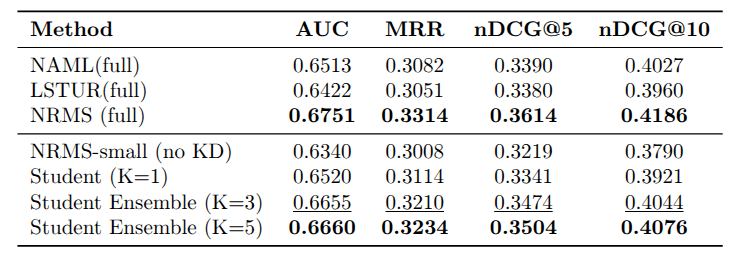

# MIND: Microsoft News Recommendation Dataset Benchmarking

## 1. Overview
The **MIND (MIcrosoft News Dataset)** is a large-scale dataset for news recommendation research, released by Microsoft. It simulates real-world news recommendation scenarios where the system predicts which article a user will click based on:

* **User Reading History**: A sequence of previously clicked news articles.
* **News Content**: Metadata including titles, bodies, categories, and subcategories.
* **Impression Context**: A set of candidate news displayed to a user (usually 1 positive click + multiple negative samples).

The dataset is widely used for academic benchmarking using metrics such as **AUC**, **MRR**, **nDCG@5**, and **nDCG@10**.

---

## 2. Implemented Models
This project implements and compares four state-of-the-art neural recommendation models proposed by Microsoft Research.

### 2.1 NRMS (Neural News Recommendation with Multi-Head Self-Attention)
NRMS uses Multi-Head Self-Attention to learn news and user representations.


* **News Encoder**: Applies multi-head self-attention over word embeddings of titles.
* **User Encoder**: Applies multi-head self-attention over the sequence of clicked news.
* **Strengths**: Simple architecture, fast training, and effective as a strong baseline.

### 2.2 NAML (Neural News Recommendation with Attentive Multi-View Learning)
NAML exploits multiple views of news (Title, Body, Category) to build richer representations.


* **Multi-View Layers**: Processes Title (CNN + Attention), Body (CNN + Attention), and Category/Subcategory embeddings.
* **View-Level Attention**: Learns the importance of each view to combine them into a final news vector.
* **Strengths**: Extremely rich news representations.
* **Weaknesses**: Higher parameter count and slower training times compared to NRMS.

### 2.3 LSTUR (Neural News Recommendation with Long- and Short-Term User Interests)
LSTUR focuses on modeling both the persistent and evolving interests of users.


* **Long-term Interest**: Learned through a dedicated User ID embedding.
* **Short-term Interest**: Modeled using a GRU (Gated Recurrent Unit) over the user's recent click history.
* **Strengths**: High personalization for active users with long histories.
* **Weaknesses**: Susceptible to the cold-start problem for new users without IDs.

### 2.4 NPA (Neural News Recommendation with Personalized Attention)
NPA introduces a personalized attention mechanism where attention weights are user-specific.


* **Personalized Attention**: User embeddings act as queries for the attention layers in both news and user encoders.
* **Strengths**: High degree of personalization; captures how different users focus on different aspects of news.
* **Weaknesses**: Risk of overfitting for users with sparse data.

---

## 3. Result


---

## 4. References
1. Wu et al., "Neural News Recommendation with Attentive Multi-View Learning", ACL 2019.
2. Wu et al., "Neural News Recommendation with Multi-Head Self-Attention", EMNLP 2019.
3. Microsoft MIND Dataset Official Documentation.

---

## 5. Installation & Setup

### 1. Clone the Repository
First, clone this repository to your local environment to access the source code and configuration files:
```bash
git clone [https://github.com/your-username/mind-news-recommendation.git](https://github.com/your-username/mind-news-recommendation.git)
cd mind-news-recommendation

# Create and activate a virtual environment (optional)
python -m venv venv
source venv/bin/activate  # On Windows: venv\Scripts\activate

# Install required libraries
pip install -r requirements.txt
```

### 2.Download dataset
Link dataset:https://drive.google.com/drive/folders/1yFI4JAN2OxJ-TXalrICrqXzZO13NINZe?usp=drive_link